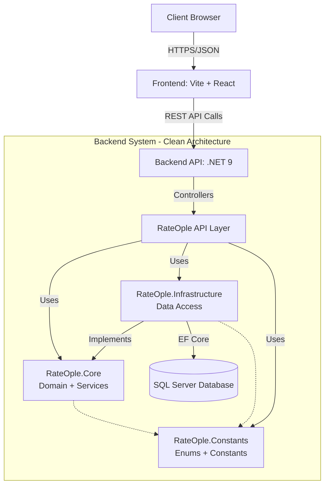
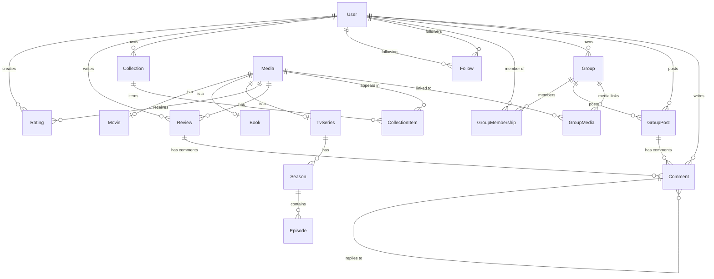

# RateOple Project Architecture

## Executive Summary
RateOple is a comprehensive media rating and social platform built using **Clean Architecture** on the backend (.NET 9) and a modern **SPA (Single Page Application)** on the frontend (Vite + React). The system supports user ratings, reviews, collections, groups, and social features for movies, books, and TV series.

**Current Status:**
- ✅ **Backend**: Complete 4-layer architecture with all domain models implemented
- ✅ **Database**: Full schema matching Prisma specification with 16+ entities
- ✅ **Authentication**: ASP.NET Core Identity with role-based authorization
- ⚠️ **Frontend**: Basic scaffolding with header, context providers, and routing

---

## 1. High-Level System Design



---

## 2. Frontend Architecture (React + Vite)

### Technology Stack
- **Framework**: React 19 (functional components with Hooks)
- **Build Tool**: Vite (fast HMR and bundling)
- **Routing**: React Router DOM v7
- **HTTP Client**: Axios
- **State Management**: Context API (ThemeContext, LanguageContext)
- **Styling**: Vanilla CSS with modern design patterns
- **Internationalization**: Custom language system (English/Bulgarian)

### Current Implementation
- ✅ **Header Component**: Logo, navigation dropdown, search bar, theme toggle, language toggle
- ✅ **Context Providers**: Theme (light/dark) and Language (en/bg) with localStorage persistence
- ✅ **Routing Structure**: Basic page scaffolding for Home, Media, About, Auth pages
- ⚠️ **API Integration**: Not yet connected to backend

### Directory Structure
```
frontend/
├── src/
│   ├── components/
│   │   ├── layout/          # Header, Footer, Sidebar, Layout
│   │   ├── ui/              # Button, Card, SearchBar, ThemeToggle, LanguageToggle
│   │   └── media/           # MediaCard, MediaGrid, MediaFilters
│   ├── pages/               # HomePage, MediaPage, Auth pages
│   ├── context/             # ThemeContext.jsx, LanguageContext.jsx
│   ├── hooks/               # useTheme.js, useLanguage.js
│   ├── services/            # api.js, auth.js
│   ├── locales/             # en.json, bg.json
│   ├── App.jsx
│   ├── main.jsx
│   └── index.css
```

---

## 3. Backend Architecture (.NET Clean Architecture)

### Technology Stack
- **Framework**: .NET 9 (ASP.NET Core Web API)
- **ORM**: Entity Framework Core 9 (SQL Server provider)
- **Authentication**: ASP.NET Core Identity with JWT support
- **Authorization**: Policy-based with role hierarchies
- **API Documentation**: OpenAPI/Swagger
- **Architecture Pattern**: Clean Architecture (4-layer)

### Solution Structure

#### **Layer 1: RateOple (API/Presentation Layer)**
*Entry point - handles HTTP requests, dependency injection, middleware*

**Responsibilities:**
- API Controllers (`FollowsController`, `MediaController`)
- Program.cs (service registration, middleware pipeline)
- Authentication & authorization configuration
- CORS policy configuration

**Dependencies:** → Core, Infrastructure, Constants

---

#### **Layer 2: RateOple.Core (Domain Layer)**
*Enterprise logic and types - has NO dependencies on other projects*

**Structure:**
```
RateOple.Core/
├── Contracts/
│   ├── IFollowService.cs
│   ├── IMediaService.cs
│   ├── IVisibilityService.cs
│   └── DTOs/
│       ├── MediaListDto.cs
│       └── MediaDetailsDto.cs
└── Services/
    ├── FollowService.cs
    ├── MediaService.cs
    └── VisibilityService.cs
```

**Current Services:**
- `IFollowService`: Follow/unfollow users, check following status
- `IMediaService`: Get media lists and details
- `IVisibilityService`: Control user and collection visibility

**Dependencies:** None (pure domain layer)

---

#### **Layer 3: RateOple.Infrastructure (Data Access Layer)**
*Implements Core contracts - handles database operations*

**Structure:**
```
RateOple.Infrastructure/
├── Data/
│   ├── ApplicationDbContext.cs
│   ├── Models/              # 16 domain entities
│   │   ├── User.cs
│   │   ├── Media.cs, Movie.cs, Book.cs, TvSeries.cs
│   │   ├── Season.cs, Episode.cs
│   │   ├── Rating.cs, Review.cs, Comment.cs
│   │   ├── Follow.cs
│   │   ├── Group.cs, GroupMembership.cs, GroupPost.cs, GroupMedia.cs
│   │   └── Collection.cs, CollectionItem.cs
│   ├── Configurations/      # EF Core Fluent API configurations (11 files)
│   └── Seeding/
│       ├── RoleSeeder.cs
│       └── SuperAdminSeeder.cs
```

**ApplicationDbContext DbSets:**
- Media: `Media`, `Movies`, `Books`, `TvSeries`, `Seasons`, `Episodes`
- Interactions: `Follows`, `Ratings`, `Reviews`, `Comments`
- Groups: `Groups`, `GroupMemberships`, `GroupPosts`, `GroupMediaLinks`
- Collections: `Collections`, `CollectionItems`

**Dependencies:** → Core

---

#### **Layer 4: RateOple.Constants (Shared Constants)**
*Enums and constant values used across all layers*

**Enums:**
- `MediaType`: Movie, Book, TvSeries
- `UserVisibility`: Public, FollowersOnly, Private
- `CollectionVisibility`: Public, Followers, Private
- `GroupVisibility`: Public, Private
- `GroupRole`: Member, Moderator, Admin
- `CommentParentType`: Review, GroupPost, Comment
- `ThemeType`: Light, Dark
- `LanguageType`: English, Bulgarian
- `Role`: User, Moderator, Admin, SuperAdmin (for schema parity)

**Constants:**
- `RoleConstants`: SuperAdmin, Admin, Moderator, User
- `PolicyConstants`: RequireAdmin, RequireModerator, CanModerateContent, CanManageGroups
- `UserConstants`: MaxBioLength, DefaultAvatarUrl, DefaultTheme, DefaultLanguage

---

## 4. Database Schema

### Entity Relationship Diagram



### Key Relationships & Constraints

**User Relationships:**
- One-to-Many: User → {Ratings, Reviews, Collections, GroupMemberships, OwnedGroups, GroupPosts, Comments}
- Self-Referencing Many-to-Many: User ↔ User (via Follow)

**Media Hierarchy:**
- Media → Movie (1:0..1)
- Media → Book (1:0..1)
- Media → TvSeries (1:0..1)
- TvSeries → Seasons → Episodes

**Unique Constraints:**
- `Rating`: (UserId, MediaId) - one rating per user per media
- `Follow`: (FollowerId, FollowingId) - prevent duplicate follows
- `GroupMembership`: (UserId, GroupId) - one membership per user per group
- `GroupMedia`: (GroupId, MediaId) - prevent duplicate media in group
- `CollectionItem`: (CollectionId, MediaId) - prevent duplicates in collection
- `Season`: (TvSeriesId, SeasonNumber) - unique season numbers
- `Episode`: (SeasonId, EpisodeNumber) - unique episode numbers

**Polymorphic Relationships (Comment):**
Comments use nullable foreign keys for polymorphic parent relationships:
- `ReviewId?` → Comment on Review
- `GroupPostId?` → Comment on GroupPost
- `ParentCommentId?` → Reply to another Comment

---

## 5. Authentication & Authorization

### Identity Configuration
- **User Model**: Custom `User` entity inheriting from `IdentityUser<Guid>`
- **Role Model**: `IdentityRole<Guid>`
- **Password Policy**: Min 6 chars, requires digit, upper, lower case

### Role Hierarchy
```
SuperAdmin
    ├── Admin
    │   └── Moderator
    │       └── User
```

### Authorization Policies
- **RequireAdmin**: Admin or SuperAdmin
- **RequireModerator**: Moderator, Admin, or SuperAdmin
- **CanModerateContent**: Same as RequireModerator
- **CanManageGroups**: Admin or SuperAdmin

### Seeding
- ✅ All roles seeded on startup (`RoleSeeder`)
- ✅ SuperAdmin user created on first run (`SuperAdminSeeder`)

---

## 6. API Endpoints (Current)

### FollowsController (`/api/follows`)
- `POST /{userId}` - Follow a user
- `DELETE /{userId}` - Unfollow a user
- `GET /{userId}/status` - Check if following a user

### MediaController (`/api/media`)
- `GET /` - Get all media
- `GET /{id}` - Get media details by ID

*Note: Additional controllers for Ratings, Reviews, Groups, Collections to be implemented*

---

## 7. Configuration

### Connection String (appsettings.json)
```json
{
  "ConnectionStrings": {
    "DefaultConnection": "Server=(localdb)\\mssqllocaldb;Database=RateOple;Trusted_Connection=true;MultipleActiveResultSets=true"
  }
}
```

### CORS Policy
- **Allowed Origin**: `http://localhost:5173` (Vite dev server)
- **Allow Credentials**: `true`
- **Allow All Headers & Methods**: `true`

---

## 8. Prisma Schema Alignment

### Schema Comparison

| Prisma Model | C# Implementation | Status |
|--------------|-------------------|--------|
| User | ✅ User (with Identity) | Complete with navigation properties |
| Follow | ✅ Follow | Complete |
| Media | ✅ Media | Complete |
| Movie | ✅ Movie | Complete |
| Book | ✅ Book | Complete |
| TVSeries | ✅ TvSeries | Complete |
| Season | ✅ Season | Complete |
| Episode | ✅ Episode | Complete |
| Rating | ✅ Rating | Complete with unique constraint |
| Review | ✅ Review | Complete |
| Comment | ✅ Comment | Complete (polymorphic via nullable FKs) |
| Group | ✅ Group | Complete |
| GroupMembership | ✅ GroupMembership | Complete with unique constraint |
| GroupPost | ✅ GroupPost | Complete |
| GroupMedia | ✅ GroupMedia | Complete with unique constraint |
| Collection | ✅ Collection | Complete |
| CollectionItem | ✅ CollectionItem | Complete with unique constraint |

### Differences from Prisma  
1. **Role Storage**: Prisma defines `Role` enum on User, but we use ASP.NET Core Identity's string-based roles for flexibility
2. **User Fields**: Prisma has `isPrivate` + `personalization`, we use `UserVisibility` enum (cleaner design)
3. **Comment Polymorphism**: Prisma uses `parentType` + `parentId`, we use nullable FKs (`ReviewId?`, `GroupPostId?`, `ParentCommentId?`)

---

## 9. Development Workflow

### Building the Project
```bash
cd backend
dotnet build RateOple.sln
```

### Running the API
```bash
cd backend/RateOple
dotnet run
```
**Swagger UI**: Navigate to `https://localhost:<port>/swagger`

### Running the Frontend
```bash
cd frontend
npm run dev
```
**Dev Server**: `http://localhost:5173`

### Creating Migrations
```bash
cd backend
dotnet ef migrations add <MigrationName> --project RateOple.Infrastructure --startup-project RateOple
dotnet ef database update --project RateOple --startup-project RateOple
```

---

## 10. Next Steps

### Backend
- [ ] Implement remaining controllers (Ratings, Reviews, Groups, Collections)
- [ ] Add comprehensive validation and error handling
- [ ] Implement JWT token generation and validation
- [ ] Add pagination and filtering for list endpoints
- [ ] Create database migration and apply to database

### Frontend
- [ ] Connect to backend API services
- [ ] Implement authentication flow (Login/Register/Logout)
- [ ] Build media browsing and detail pages
- [ ] Implement rating and review submission
- [ ] Create user profile and collection management
- [ ] Add group features and social interactions

### DevOps
- [ ] Set up CI/CD pipeline
- [ ] Configure production database
- [ ] Deploy to hosting environment
- [ ] Set up monitoring and logging
